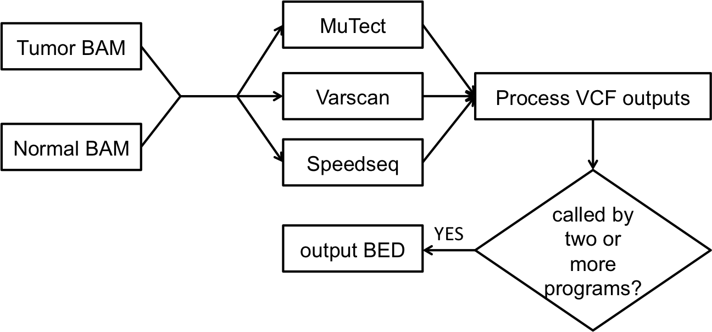

# callerSquad
Group voting based ensembl somatic mutation caller.



## Table of Contents
1. [Installation](#installation)
2. [Before running](#preparation)
3. [Running callerSquadd](#usage)
4. [Examples](#examples)

## Installation
	```
	git clone --recursive https://github.com/Danko-Lab/callerSquad
	```
## Before running
#### Prerequisites
* samtools suite, including samtools, bcftools, and all of their dependencies (http://www.htslib.org/)
* Java 6 or up
* Python 2.7 (https://www.python.org/)
	* numpy
	* pysam 0.8.0+
	* scipy
* successfully deployed MuTect
* successfully deployed Varscan (http://sourceforge.net/projects/varscan/files/VarScan.v2.3.9.jar/download)
* successfully installed speedseq somatic functionality, no need for whole software (https://github.com/hall-lab/speedseq)

#### Tumor and normal BAM files
These bam files should be whole/targeted genome sequencing of tumor/normal samples from the same patient aligned to the same reference genome, e.g. TCGA WGS.

#### Reference genome
Check your bam file header for the correct reference genome used for alignment, download the fasta file, and prepare it as described in: http://gatkforums.broadinstitute.org/discussion/2798/howto-prepare-a-reference-for-use-with-bwa-and-gatk

## Running callerSquad
#### Usage
```
Program: callerSquad
Version: 0.1.0
Author: Xiaotong Yao (xy293@cornell.edu)

usage: callerSquad [OPTIONS] tumor.bam normal.bam

positional args:
    tumor.bam	path to bam file of tumor sample sequence read alignments,
		with index (.bam.bai) in the same dir
    normal.bam	path to bam file of normal sample sequence read alignments,
		with index (.bam.bai) in the same dir

options:
    -o, --outBasename
	All results will be saved to currentRunningDir/outBasename/. (default: 'defaultRun')
    -R, --reference
	FASTA-format reference genome with BW index in same directory. (required)
    -B, --regionBed
	BED file of target genomic regions for calling, 0-based start position 
	and 1-based end position. (required)
    -t, --numberOfthreads
	Maximum number of threads to use for each caller program. (default 1)
    --help, -h
	Print this message.

Documentations of callerSquad can be found at:
    https://github.com/Danko-Lab/callerSquad
```

#### Example
	```
	/path/to/source/code/callerSquad.sh \
	-o exampleName \
	-t 2 \ # use 2 threads for each caller
	-R /path/to/reference/genome/GRCh37-lite.fa \ # make sure .fai .dict .deflines are in the same place as .fa
	-B /home/xy293/Data/test/ceph18.b37.include.2014-01-15.bed \ # make sure bed match ref genome
	/path/to/tumor.bam \
	/path/to/normal.bam
	```

#### Output
